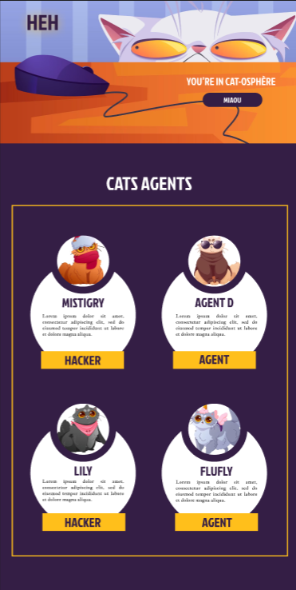

# CAT SPY

## OVERVIEW

This repository was created during the first week of the Web Developer bootcamp at the Wild Code School. The objective of this exercise was to replicate a model provided on Figma, incorporating a responsive design.

## TECHNOLOGIES USED

- HTML5
- CSS3

## ACCESS TO THE PAGE

The deployed page is accessible here: https://paul-lac.github.io/Cat_Spy/
